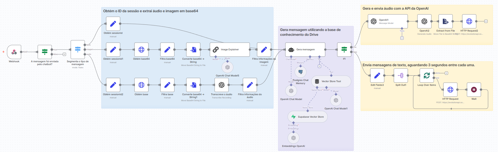
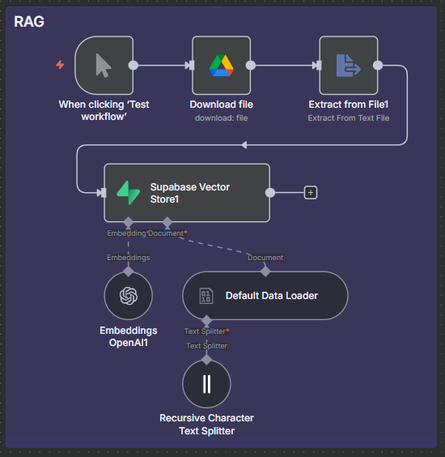

# SouzAI  
Este fluxo automatiza o processamento de mensagens recebidas via WhatsApp (texto, imagem ou áudio), utiliza OpenAI (incluindo GPT-4o) para gerar respostas, realiza transcrição de áudio, descrição de imagens, gera áudios falados e envia as respostas de volta.

A solução foi criada e hospedada em uma VPS com domínio próprio, mantendo a segurança por meio de criptografia, atualizações regulares, autenticação robusta e monitoramento contínuo, além de assegurar escalabilidade e controle total da infraestrutura.

---

#### Principais Tecnologias Utilizadas
| Nome | Versão|
|:------- |:------- |
|n8n | 1.104.2 |
| Evolution API | 2.3.1 | 
| OpenAI API | gpt-4o-mini e TTS-1-HD |
| Supabase | 17.4.1.062 |
| Postgres | 1.1 (chat memory)

---

#### Visão Geral do Projeto
O chatbot foi projetado para resolver dúvidas sobre o n8n com suporte multimodal: processa entradas de texto, áudio e imagem, e responde em formato de texto e áudio. A arquitetura combina inteligência generativa da API da OpenAI com uma base de conhecimento proprietária — esta última é priorizada como fonte primária através de um mecanismo de Retrieval-Augmented Generation (RAG).

O fluxo é o seguinte: consultas do usuário são analisadas, partes relevantes são usadas para buscar documentos ou trechos na base interna indexada, e esses dados são incorporados como contexto adicional nas chamadas à OpenAI, reduzindo alucinações e aumentando precisão. A indexação da base de conhecimento utiliza vetorização (embeddings) e uma camada de similaridade para recuperação eficiente dos resultados mais pertinentes. Há também um componente de fallback para lidar com perguntas fora do escopo da base, onde a OpenAI atua com maior autonomia, mas ainda sob controle de prompt e validações.

---
#### Por Dentro do Workflow

**Etapas Principais**
**Disparo via Webhook, por um POST externo.**
- Recebe mensagens do WhatsApp via API do Evolution.

---

**Validação da Mensagem**
Node: A mensagem foi enviada pelo chatbot?

- Garante que a mensagem foi enviada por um usuário (e não pelo próprio bot).

---

**Segmentação da Mensagem**
Node: Segmenta o tipo de mensagem

Identifica se a mensagem é:

conversation → Texto

imageMessage → Imagem

audioMessage → Áudio

---

**Processamento da Mensagem (Branching)**
 
**🟦 Texto**
Obtém o sessionId (Obtém sessionId)

Normaliza mensagem + contexto (Gera mensagem)

Verifica se é áudio (para gerar voz) (If → false)

Divide mensagens (Edit Fields3, Split Out)

Envia cada uma com intervalo de 3s (Loop Over Items, Wait, HTTP Request)

**🟩 Imagem**
Download via base64 (Obtém base64)

Conversão para binário (Converte base64 -> String)

Descrição da imagem + texto (Image Explainer)

Prepara mensagem + sessionId (Filtra informações da imagem)

Processa via LLM (Gera mensagem → continua como no ramo texto)

**🟥 Áudio**
Download via base64 (Obtém base)

Conversão para binário (Converte base64 -> String)

Transcrição do áudio (Transcreve o áudio)

Prepara mensagem + sessionId (Filtra informações do áudio)

Processa via LLM (Gera mensagem)

Gera versão falada da resposta (OpenAI1)

Gera arquivo .mp3 (OpenAI)

Converte e envia áudio via API (Extract from File, HTTP Request)

**📦 Envio das Respostas de Texto**
Feito em lote, com Split Out, Loop, Wait

API de envio:

POST para Evolution API

Autenticação: via Header com apikey

---

**🔊 Envio das Respostas em Áudio**
Geração de áudio falado com OpenAI TTS

Envio via:

POST para Evolution API

---

**🧠 Base de Conhecimento com RAG (Google Drive + Supabase)**

 
Document Loader e Embeddings:
Download do documento: Download file

Extração: Extract from File

Chunking: Recursive Character Text Splitter

Embedding: Embeddings OpenAI

Armazenamento: Supabase Vector Store

Uso na Resposta:
Chat com memória e vetor: OpenAI Chat Model, Postgres Chat Memory, Vector Store Tool

Geração da resposta contextualizada: Gera mensagem
